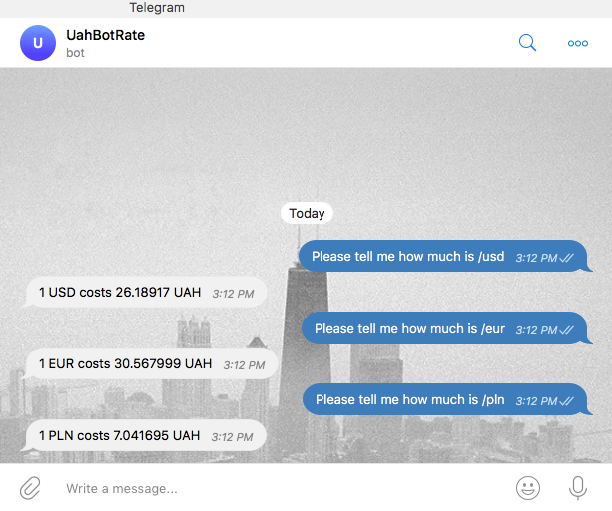

[](https://www.python.org/)
[](https://github.com/psf/black)
[](LICENSE.md)

# UAH rate telegram bot
> Basic telegram bot to get latest UAH (Ukraine currency) exchange rate comparing to other currencies.
> 
> Bot is called `UahExRateBot` that served by [pythonanywhere.com](https://pythonanywhere.com) hosting, search for it in the telegram app.

## Tools:

### Production
- python 3.6+
- [flask](https://flask.palletsprojects.com) web framework

### Development
- [black](https://black.readthedocs.io/en/stable/) code formatter

## Usage


Run script from the root directory of the project:
```bash
python bot.py
```

## Development notes

### Meta

Author – _Volodymyr Yahello_. Please check [AUTHORS](AUTHORS.md) file for all contributors.

Distributed under the `MIT` license. See [LICENSE](LICENSE.md) for more information.

You can reach out me at:
* [vyahello@gmail.com](vyahello@gmail.com)
* [https://twitter.com/vyahello](https://twitter.com/vyahello)
* [https://www.linkedin.com/in/volodymyr-yahello-821746127](https://www.linkedin.com/in/volodymyr-yahello-821746127)

### Contributing
I would highly appreciate any contribution and support. If you are interested to add your ideas into project please follow next simple steps:

1. Clone the repository
2. Configure `git` for the first time after cloning with your `name` and `email`
3. `pip install -r requirements.txt` to install all project dependencies
4. `pip install -r requirements-dev.txt` to install all development project dependencies
5. Create your feature branch (`git checkout -b feature/fooBar`)
6. Commit your changes (`git commit -am 'Add some fooBar'`)
7. Push to the branch (`git push origin feature/fooBar`)
8. Create a new Pull Request
